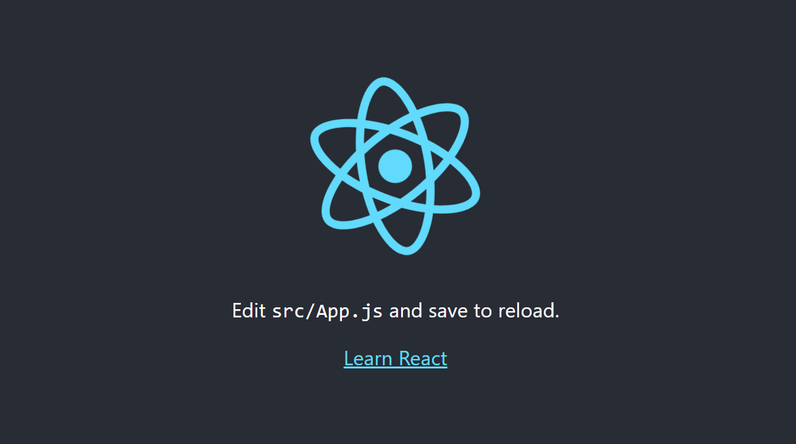
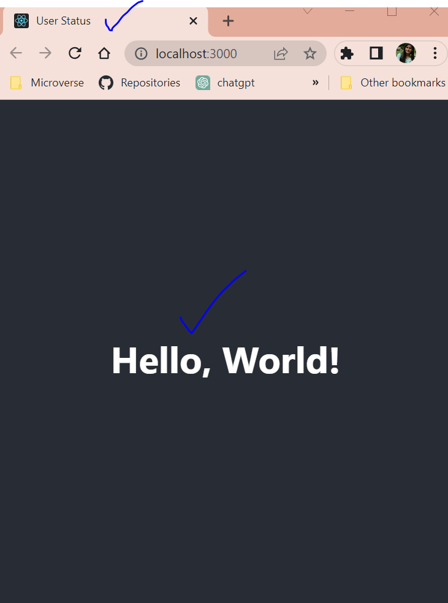

<!-- PROJECT DESCRIPTION -->

# 📖 [Follow step by step to build this project] <a name="about-project"></a>

> 1. Create a new repo
> 2. Clone it on your local machine (git clone repo-name.git)
> 3. create a new branch called dev (git checkout -b dev)
> 4. Make the branch dev as default branch on GitHub
> 5. Delete any unused file
> 6. commit and push 
      (git add .)
      (git commit -m "commit-message")
      (git push)
> 7. create a new branch called react-redux-api (git checkout -b react-redux-api)

**Create a new REACT APP**

> 8. create a new react app using create-react app
      (npx create-react-app .)
> 9. start your application (npm start)
      - your default react app should start without any error
      
> 10. Remove all boilerplates (files, text, images)
      - your file structure should look like this:
          redux-api
          |-- node_modules
          |-- public
              |-- index.html
          |-- src
              |-- App.css
              |-- App.jss
              |-- index.css
              |-- index.js
          |-- .gitignore
          |-- package-lock.json
          |-- package.json
          |-- README.md

> 11. refactor file structure inside /src directory
    - your file structure should look like this now:
      <code>
          /src
          |-- components
              |-- App.jss
          |-- styles
              |-- index.css
              |-- App.css
          |-- index.js
      </code>
> 12. Change title in index.html
      <title>Your-app-name</title>
> 13. Adjust imports in App.js and index.js
  /src/components/App.js
    import '../styles/App.css';
  /src/index.js
    import './styles/index.css';
    import App from './components/App';
> 14. return "Hello World" from APP component
      <div className="App">
        <header className="App-header">
          <h1>Hello, World!</h1>
        </header>
     </div>

> 15. Start your app (npm start)
      - your app should look like this:
      

**REDUX Toolkit**

> 16. Install redux toolkit
      (npm install react-redux @reduxjs/toolkit)
      (npm install @reduxjs/toolkit react-redux)
> 17. create a directory called /src/redux to hold all redux logics
> 18. create a new Redux store at:
        /src/redux/store.js

> 19. Create an empty Redux store: In /src/redux/store.js:
```
import { configureStore } from '@reduxjs/toolkit'

const store = configureStore({
  reducer: {},
})

export default store;
```

> 20. Provide the redux store to react:
      In src/index.js :
```
      import React from 'react';
      import ReactDOM from 'react-dom/client';
      import './styles/index.css';
      import App from './components/App';
      import { store } from './redux/store';
      import { Provider } from 'react-redux';

      const root = ReactDOM.createRoot(document.getElementById('root'));
      root.render(
      <React.StrictMode>
            <Provider store={store}>
                  <App />
            </Provider>
      </React.StrictMode>
      );
```

> 21. Create a redux state slice:
      - Add a new directory: /src/redux/users
      - Add a new file: /src/redux/users/usersSlice.js
      - In file /src/redux/users/usersSlice.js :
```
      import { createSlice } from "@reduxjs/toolkit";

      const initialState = {
            users: [],
            isLoading: false,
            error: undefined,
      }

      const usersSlice = createSlice({
            name: 'users',
            initialState,
            reducers: {
                  getUsers: (state) => {
                        state.isLoading = true;
                  }
            },
            extraReducers: {},
      });

      export const { getUsers } = usersSlice.actions;

      export default usersSlice.reducer;
```

> 22. 